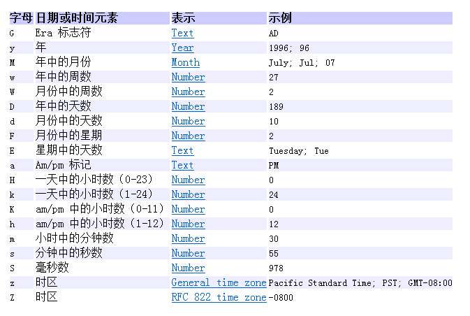
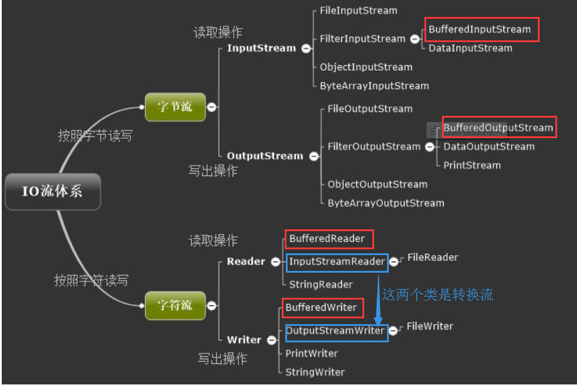
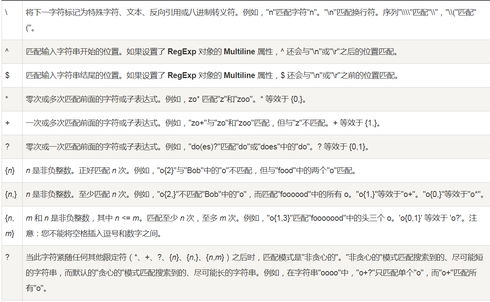
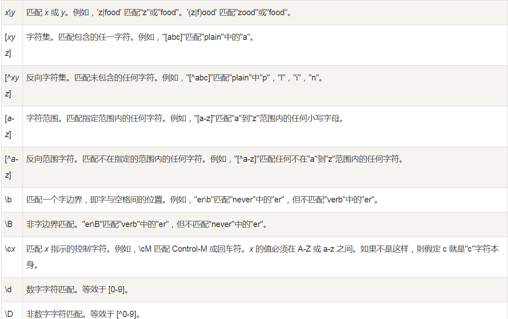
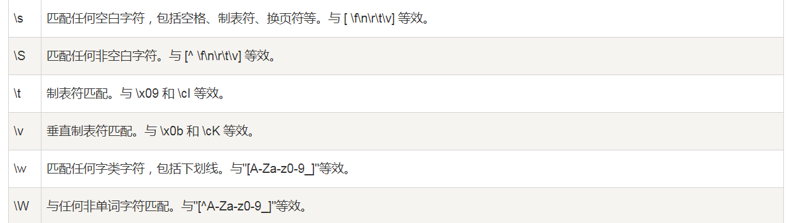

#日期的介绍
##Date类
位于java.util包下，无参的构造方法用来创建当前日期时间的Date对象，long类型参数date的构造方法用来创建指定时间的Date对象，
其中long类型参数表示1970年1月1日00:00:00以来的毫秒数。
###常用方法
* long getTime():返回自1970年1月1日00:00:00GMT(格林威治时间)依赖此Date对象表示的毫秒数。
##Calendar类
位于java.util包下，Calendar类是一个抽象类，不可以被实例化，在程序中需要调用静态方法getInstance()来得到Calendar对象。
该类可以通过指定的方法设置和读取日期的特定部分
###常用方法
* int get(int field):通过指定字段来取得想要的时间信息
* void set(int field，int value):将给定的日历字段设置给定的值
* void add(int field,int amount):可以指定日历中的字段，进行整数的偏移
* Date getTime():将日历对象转换成Date日期对象
###字段常量
* Calendar.YEAR当前年份
* Calendar.MONTH当前月份(月份是从0开始计数，当超过11时默认年份会加1)
* Calendar.DAY_OF_MONTH当前天数
* Calendar.DAY_OF_WEEK当前星期几，用数字1-7表示星期天到星期六
* Calendar.DAY_OF_YEAR当前年的第几天
##DateFormat类
位于java.text包下,DateFormat类是抽象类，不能直接实例化，提供了静态方法，通过静态方法可以获取该类的实例对象。
DateFormat类专门用于将日期格式化为字符串或者用特定格式显示的日期字符串转换成一个Date对象
###常用方法介绍
* static DateFormat getDateInstance():用于创建默认语言环境和风格的日期格式器
* String format(Date date):将一个Date格式化为日期/时间字符串
* Date parse(String source):将给定字符串解析为日期对象
###常量值
* DateFormat.FULL(完整格式)
* DateFormat.LONG(长格式)
* DateFormat.MEDIUM(普通格式)
* DateFormat.SHORT(短格式)
```java
public class DateFormatTest {

    /*按指定要求格式化日期*/
    public static void main(String[] args){
       //使用DateFormate去格式化时间
        Date date = new Date();
        DateFormat dateFormat = DateFormat.getDateInstance();
        System.out.println("格式化当前日期："+dateFormat.format(date));
        DateFormat dateTimeInstance = DateFormat.getDateTimeInstance();
        System.out.println("格式化当前具体时间："+dateTimeInstance.format(date));
        //日期的完整格式
        DateFormat dateInstance1 = DateFormat.getDateInstance(DateFormat.FULL);
        System.out.println("当前时间完整格式："+dateInstance1.format(date));
        //日期的默认格式
        DateFormat dateInstance2 = DateFormat.getDateInstance(DateFormat.DEFAULT);
        System.out.println("当前时间默认格式："+dateInstance2.format(date));
        //日期的长格式
        DateFormat dateInstance3 = DateFormat.getDateInstance(DateFormat.LONG);
        System.out.println("当前时间长格式："+dateInstance3.format(date));
    }
}
/*打印结果
格式化当前日期：2020-5-21
格式化当前具体时间：2020-5-21 8:12:29
当前时间完整格式：2020年5月21日 星期四
当前时间默认格式：2020-5-21
当前时间长格式：2020年5月21日*/
```
###SimpleDateFormat类
SimpleDateFormat是DateFormat的子类，可以实现自定义类型时间的转换,其中参数见下表：

```java
public class SimpleDateFormateTest {
    /*自定义类型格式化日期*/
    public static void main(String[] args){
       
        //创建格式化日期对象
        SimpleDateFormat dateFormat = new SimpleDateFormat("一年中的第 D 天 第w个星期 一月中第W个星期 在一天中k时 z时区");
        //将当前日期格式化为相应的字符串形式
        String dateStr = dateFormat.format(new Date());
        System.out.println("格式化后的日期："+dateStr);
    }
}
```
##JDK8日期新特性
JDK8 中增加了一套全新的日期时间 API,是线程安全的。新的日期及时间 API 位于 java.time 包下，如下是一些该包下的关键类：
* LocalDate：表示日期，包含：年月日。格式为：2020-01-13
* LocalTime：表示时间，包含：时分秒。格式为：16:39:09.307
* LocalDateTime：表示日期时间，包含：年月日 时分秒。格式为：2020-01-13T16:40:59.138
* DateTimeFormatter：日期时间格式化类
* Instant：时间戳类
* Duration：用于计算 2 个时间(LocalTime，时分秒)之间的差距
* Period：用于计算 2 个日期(LocalDate，年月日)之间的差距
* ZonedDateTime：包含时区的时间
线程不安全示例
```java
public class DateDemo01 {
    public static void main(String[] args) {
        //时间格式化和解析是线程不安全的
        SimpleDateFormat sdf = new SimpleDateFormat("yyyy-MM-dd");
        for (int i = 0; i < 30; i++) {
            new Thread(()->{
                try {
                    Date date = sdf.parse("2020-05-20");
                    System.out.println("date:"+date);
                } catch (ParseException e) {
                    e.printStackTrace();
                }
            }).start();
        }
    }
}
/*程序运行会有日期格式化错误和抛出NumberFormatException异常，说明线程是不安全*/

```
LocalDate、LocalTime、LocalDateTime类的实例是不可变的对象，分别表示使用 ISO-8601 日历系统的日期、时间、日期和时间。
###DateTimeFormatter类介绍
####该类提供的三种格式化方法
* 预定义的标准格式：ISO_LOCAL_DATE_TIME,ISO_LOCAL_DATE,ISO_LOCAL_TIME
* 本地有关的格式：fLocalizedDateTime(FormatStyle.LONG)
* 自定义的格式：ofPattern("yyyy-MM-dd hh:mm:ss E")
####常用方法
* ofPattern(String pattern):静态方法，返回一个指定字符串格式的DateTimeFormatter
* format(TemporalAccessor t):给实话一个日期，时间，返回字符串
* parse(CharSequence text):将指定格式的字符序列解析为一个日期，时间
#IO体系
* 流按照流向数据流可以分为输入流和输出流，用途如下：
    * 输入流是指程序从数据源中读取数据。只进行读操作
    * 输出流是指将数据从程序中写到指定的文件中
* 流按照处理数据类型的单位不同可以分为字节流和字符流，两者的区别：
    * 读写单位不同：字节流是以字节（8位2进制）为单位，字符流是以字符为单位，根据码表映射字符，一次可能读多个字节。
    * 处理对象不同：字节流能处理所有类型的数据（如图片、avi等），而字符流只能处理字符类型的数据。

##字节流介绍
字节流是java中可以按照最小字节单位读取的流，即每次读写一个字节，字节流是直接连接到输入源的流
* OutputStream是字节输出流的抽象类，按照抽象类的基本原则来讲，如果想要取得OutputStream类的实例化对象那么一定需要子类，如果要进行文件的操作，可以使用FileOutputStream类来处理，
    * 这个类的构造方法如下：
        * 接收File类（覆盖）：public FileOutputStream(File file) throws FileNotFoundException
        * 接收File类（追加）：public FileOutputStream(File file, boolean append)
    * 输出方法如下：
        * 将给定的字节数组内容全部输出：void write(byte b[]) throws IOException;
        * 将部分字节数组内容输出：void write(byte b[], int off, int len) throws IOException;
        * 输出单个字节：void write(int b) throws IOException;
* InputStream是字节输入流的抽象类，所以要进行文件的读取使用FileInputStream子类。
    * 子类定义的构造方法如下：
        * public FileInputStream(File file) throws FileNotFoundException
    * 读取数据方法如下：
        * 读取单个字节：int read() throws IOException 每次执行此方法将读取当个字节数据，如果已经读取完成了，那么最后返回-1。
        * 读取数据到字节数组中：int read(byte b[]) throws IOException 数据读取到数组之中，那么会返回一个读取长度的数据，如果没有数据则返回的长度为-1，可是要考虑两种情况：
            * 要读取的内容大于开辟的数组内容：长度就是整个数组的长度。
            * 要读取的内容小于开辟数组的内容：长度就是全部最后的内容长度，数组装不满。
        * 读取部分内容到字节数组中：int read(byte b[], int off,int len) throws IOException 每次读取内容到部分字节数组，只允许读取满限制的数组的字节个数。此方法依然会返回读取的长度。
* BufferedInputStream/BufferedOutputStream
具有缓存功能的字节输入、输出流。缓存的目的：解决在写入文件操作时，频繁的操作文件所带来的性能降低的问题，BufferedOutputStream内部默认的缓存大小是8KB，每次写入时存储到缓存中byte
数组中，当数组存满时，会把数组中的数据写入文件，并将缓存下标置为0
* ObjectInputStream/ObjectOutputStream
对象流的主要作用就是将Java对象序列化（持久化），并保存到本地磁盘文件，或者将磁盘文件反序列化成Java对象。将Java对象转化为一个字节序列，就叫做对象序列化。反之，将一个序列文件转化为Java对象，这个过程称作反序列化。
```java
public class ObjectIOTest {

    /*
     * 将对象反序列化
     */
    @Test
    public void outObject(){
        //创建文件输出流
        FileOutputStream fos = null;
        ObjectOutputStream oos = null;
        try {
            fos = new FileOutputStream("e://object.txt");
            //创建对象输出流
            oos = new ObjectOutputStream(fos);
            //有参构造赋值
            Person boy = new Person("Peter",12);
            //写出数据
            oos.writeObject(boy);
            
        } catch (FileNotFoundException e) {
            e.printStackTrace();
        } catch (IOException e) {
            e.printStackTrace();
        }finally {
            if(oos!=null){
                //关流
                try {
                    oos.close();
                } catch (IOException e) {
                    e.printStackTrace();
                }
            }
        }
    }
    /*
     * 将对象序列化转换为对象
     */
    @Test
    public void testOIS(){
        //创建文件输入流
        FileInputStream fis = null;
        ObjectInputStream ois = null;
        try {
            fis = new FileInputStream("e://object.txt");
            //创建对象输入流
            ois = new ObjectInputStream(fis);
            //读取二进制文件转换成对象
            Person boy = (Person)ois.readObject();
            System.out.println(boy);
            //关流
            ois.close();
        } catch (FileNotFoundException e) {
            e.printStackTrace();
        } catch (IOException e) {
            e.printStackTrace();
        } catch (ClassNotFoundException e) {
            e.printStackTrace();
        }finally{
            if(ois!=null){
                try {
                    ois.close();
                } catch (IOException e) {
                    e.printStackTrace();
                }
            }
        }
    }
}
```
##字符流介绍
通过任何终端（网络、文件）读取或者输出的数据都一定是字节，但是字符是经过内存处理后的数据。
* 字符输入：字节（磁盘）–> 自动转换为 –>字符（内存）；
* 字符输出：字符（内存）–> 自动转换为–>字节（磁盘）；
在利用字符流输出的时候，所有的内容实际上都只是输出到了缓冲区中（内存）。在使用close()方法关闭的时候会将我们缓冲区的数据进行输出，如果没有关闭，那么就将无法进行输出，此时可以利用flush()方法进行强制的输出。
* Writer是进行字符输出操作使用的类，这个类属于抽象类， 要进行文件字符流操作可以使用FileWriter
    * 构造方法如下：
        * public FileWriter(File file)。
    * 输出方法如下：
        * 可以直接输出字符串： void write(String str) throws IOException
* Reader是一个抽象类，要进行文件字符流操作可以使用FileReader
     * 构造方法如下：
         * public FileReader(File file)。
     * 读取方法如下：
         * 数据的读取：int read(char[] cbuf) throws IOException
* OutputStreamWriter是输出字节流通向输出字符流的桥梁，用于将字节输出流转换成字符输出流，也就是完成将要写入的字符使用特定的编码转码成字节，再将转换后的字节写入到底层字节输出流中。可以指定编码。
StreamEncoder本质是OutputStreamWriter内部的一个类。这个类来完成上面所有的工作，是这个类使用指定的或者默认的编码来将要写入的字符转码成字节，然后调用StreamEncoder的方法来将转码后的字节写入到底层流中。OutputStreamWriter中所有的方法都是调用StreamEncoder来实现的，OutputStreamWriter只是对StreamEncoder进行了封装、什么都没有做。
    * 常用构造方法如下：
        * OutputStreamWriter(OutputStream out, String charsetName)创建使用指定字符集的OutputStreamWriter，不指定字符集默认是utf-8
        * OutputStreamWriter(OutputStream out) 创建一个使用默认字符集的OutputStreamWriter
    * 常用方法如下：
        * 写入单个字符：void write(int c)   
        * 写入字符数组的某一部分：void write(char cbuf[], int off, int len)    
        * 写入字符串的某一部分：void write(String str, int off, int len)      
        * 刷新该流的缓冲：void flush()    
        * 关闭此流，但要先刷新它：void close()    
* InputStreamReader是字节转换为字符的桥梁，它可以按指定的charset读取字节并将其解码为字符。
输入字符转换流是输入字节流转向输入字符流的桥梁，用于将输入字节流转换成输入字符流，通过指定的或者默认的编码将从底层读取的字节转换成字符返回到程序中。
与OutputStreamWriter一样，本质也是使用其内部的StreamDecoder类来完成所有工作。
    * 常用构造方法如下：
        * InputStreamReader(InputStream in)创建一个使用默认字符集的InputStreamReader
        * InputStreamReader(InputStream in,String charsetName)创建使用指定字符集的InputStreamReader，不指定字符集默认是utf-8。
    * 常用方法如下：
        * 读取单个字符：int read() 
        * 将字符读入数组中的某一部分：int read(char cbuf[], int offset, int length)
        * 关闭该流并释放与之关联的所有资源：void close()
```java
public class ExerciseTest {
    
    static HashMap<String,String> map = new HashMap();
    static ArrayList<String> list = new ArrayList();
    public static void main(String[] args) {
        Scanner sr = new Scanner(System.in);
        while(true){
            System.out.println("请输入你要查找的学号：");
            String stuNo = sr.next();
            if("exit".equals(stuNo)){
                break;
            }else{
                //创建文件对象
                File file = new File("e://studentInfo.txt");
                
                try(BufferedReader br = new BufferedReader(new InputStreamReader(new FileInputStream(file)))) {
                    String len;
                    //读取文件内容
                    while((len=br.readLine())!=null){
                        //将文件内容添加到list集合
                        list.add(len);
                    }
                    //打印出用户想要的信息
                    System.out.println(split(list,stuNo));
                } catch (FileNotFoundException e) {
                    e.printStackTrace();
                } catch (IOException e) {
                    e.printStackTrace();
                }
            }
            }
    }
    public static String split(ArrayList<String> list,String stuNo){
        //遍历集合分割数据
        for (String str : list) {
            String[] arr = str.split("/");
            map.put(arr[0],arr[1]);
        }
        //获取Map对应键的集合
        Set<String> keySet = map.keySet();
        for(String str: keySet){
            //循环判断两个的值是否一致
            if(stuNo.equals(str)){
                //一致返回数据信息
                return map.get(str);
            }
        }
        return "没有该学生！！！";
    }
}

```
##NIO介绍
NIO是JDK1.4加入的新包，NIO的创建目的是为了让java程序员可以实现高速i/o，而无需编写自定义的本机代码。NIO将最耗时I/O操作(即填充和提取缓冲区)转移回操作系统。
传统的IO是一种同步的阻塞IO，IO在进行读写时，该线程将被阻塞，线程无法进行其它操作。
IO流在读取时，也会阻塞。直到发生以下情况：
* 有数据可以读取。
* 数据读取完成。
* 发生异常
###NIO与传统IO的区别
* IO是面向流的，NIO是面向缓冲区的。Java IO面向流意味着每次从流中读一个或多个字节，直至读取所有字节，它们没有被缓存在任何地方。此外，它不能前后移动流中的数据。
如果需要前后移动从流中读取的数据，需要先将它缓存到一个缓冲区。NIO的缓冲导向方法略有不同。数据读取到一个它稍后处理的缓冲区，需要时可在缓冲区中前后移动。这就增加了处理过程中的灵活性。但是，还需要检查是否该缓冲区中包含所有您需要处理的数据。而且，需确保当更多的数据读入缓冲区时，不要覆盖缓冲区里尚未处理的数据。
* IO的各种流是阻塞的。这意味着，当一个线程调用read() 或 write()时，该线程被阻塞，直到有一些数据被读取，或数据完全写入。该线程在此期间不能再干任何事情了。
 NIO的非阻塞模式，使一个线程从某通道发送请求读取数据，但是它仅能得到目前可用的数据，如果目前没有数据可用时，就什么都不会获取。而不是保持线程阻塞，所以直至数据变的可以读取之前，该线程可以继续做其他的事情。线程通常将非阻塞IO的空闲时间用于在其它通道上执行IO操作，所以一个单独的线程现在可以管理多个输入和输出通道（channel）。
 
###NIO的主要组成部分
主要有三大核心部分：Channel(通道)，Buffer(缓冲区), Selector（多路复用器）。
传统IO基于字节流和字符流进行操作，而NIO基于Channel和Buffer(缓冲区)进行操作，数据总是从通道读取到缓冲区中，或者从缓冲区写入到通道中。
Selector(多路复用器)用于监听多个通道的事件（比如：连接打开，数据到达）。因此，单个线程可以监听多个数据通道。

####Channel(通道)
Channel是一个双向通道，与传统IO操作只允许单向的读写不同的是，NIO的Channel允许在一个通道上进行读和写的操作。
####Buffer(缓冲区)
Buffer缓冲区本质上是一块可以写入数据，然后可以从中读取数据的内存。这块内存被包装成NIO Buffer对象，并提供了一组方法，用来方便的访问该模块内存。
* 属性介绍：
    * capacity：作为一个内存块，Buffer有固定的大小值，也叫作“capacity”，只能往其中写入capacity个byte、long、char等类型。一旦Buffer满了，需要将其清空才能继续写数据。
    * position：当你写数据到Buffer中时，position表示当前的位置。初始的position值为0，当写入一个字节数据到Buffer中后，position会向前移动到下一个可插入数据的Buffer单元。position最大可为capacity-1。当读取数据时，也是从某个特定位置读，将Buffer从写模式切换到读模式，position会被重置为0。当从Buffer的position处读取一个字节数据后，position向前移动到下一个可读的位置。
    * limit：在写模式下，Buffer的limit表示你最多能往Buffer里写多少数据。 写模式下，limit等于Buffer的capacity。当切换Buffer到读模式时， limit表示你最多能读到多少数据。因此，当切换Buffer到读模式时，limit会被设置成写模式下的position值。换句话说，你能读到之前写入的所有数据（limit被设置成已写数据的数量，这个值在写模式下就是position）
* Buffer的分配
    * Buffer提供一个allocate(int capacity)方法分配一个指定字节大小的对象。
* 方法介绍
    * 将数据通过put()方法写入到buf中：buf.put(byte)    
    * 将channel中的数据读取到buf中：channel.read(buf); 
    * 将Buffer从写模式切换到读模式：flip()方法 调用flip()方法会将position设置为0，并将limit设置为之前的position的值。
    * 将buf中的数据写入到channel中：channel.write(buf); 
    * 从buf中读取一个byte：buf.get(); 
    * clear()与compact()方法：一旦读完Buffer中的数据，需要让Buffer准备好再次被写入，可以通过clear()或compact()方法完成。
    如果调用的是clear()方法，position将被设置为0，limit设置为capacity的值。但是Buffer并未被清空，只是通过这些标记告诉我们可以从哪里开始往Buffer中写入多少数据。如果Buffer中还有一些未读的数据，调用clear()方法将被"遗忘 "。
    compact()方法将所有未读的数据拷贝到Buffer起始处，然后将position设置到最后一个未读元素的后面，limit属性依然设置为capacity。可以使得Buffer中的未读数据还可以在后续中被使用。
####Selector(多路复用器)
Selector与Channel是相互配合使用的，将Channel注册在Selector上之后，才可以正确的使用Selector，但此时Channel必须为非阻塞模式。
Selector可以监听Channel的四种状态（Connect、Accept、Read、Write），当监听到某一Channel的某个状态时，才允许对Channel进行相应的操作。

```java
/*创建一个输入文件的通道*/
public class NIOTest{
    public static void main(String[] args){
        FileChannel fcIn = null;
        FileChannel fcOut = null;
        try {
            //创建一个输入文件的通道
            fcIn = new FileInputStream("e://300.jpg").getChannel();
            //创建一个输出文件的通道
            fcOut = new FileOutputStream("e://test//300.jpg").getChannel();
            ByteBuffer buf = ByteBuffer.allocate(1024);
            //将通道中的数据读取到缓冲区
            while (fcIn.read(buf)!=-1){
                //切换写模式
                buf.flip();
                //将缓冲区中的数据读取到通道中
                fcOut.write(buf);
                buf.clear();
            }
            
        } catch (FileNotFoundException e) {
            e.printStackTrace();
        } catch (IOException e) {
            e.printStackTrace();
        } finally {
            //关闭输出流
            if(fcOut!=null){
                try {
                    fcOut.close();
                } catch (IOException e) {
                    e.printStackTrace();
                }
            }
            //关闭输入流
            if(fcIn!=null){
                try {
                    fcIn.close();
                } catch (IOException e) {
                    e.printStackTrace();
                }
            }
        }
       
    }
}
```
#正则表达式介绍
正则表达式定义了字符串的模式。
* 主要类：
    * Pattern：pattern 对象是一个正则表达式的编译表示。Pattern 类没有公共构造方法。要创建一个 Pattern 对象，你必须首先调用其公共静态编译方法，它返回一个 Pattern 对象。该方法接受一个正则表达式作为它的第一个参数。
    * Matcher ：Matcher 对象是对输入字符串进行解释和匹配操作的引擎。与Pattern 类一样，Matcher 也没有公共构造方法。你需要调用 Pattern 对象的 matcher 方法来获得一个 Matcher 对象。
##表达式语法



##组
捕获组是把多个字符当一个单独单元进行处理的方法，它通过对括号内的字符分组来创建。